<div align="center">


</div>

```aura width=800 height=1100
<div style={{ display: 'flex', flexDirection: 'column', width: '100%', height: '100%', background: '#06060a', borderRadius: 20, padding: 25, fontFamily: 'Inter, sans-serif', position: 'relative', overflow: 'hidden', border: '1px solid rgba(110,80,220,0.2)', gap: 15 }}>
  <style>
    {`
      @keyframes drift-r { 0%, 100% { transform: translate(0, 0); opacity: 0.7; } 50% { transform: translate(45px, -22px); opacity: 1.15; } }
      @keyframes drift-l { 0%, 100% { transform: translate(0, 0); opacity: 0.6; } 50% { transform: translate(-40px, 20px); opacity: 1.05; } }
      @keyframes drift-u { 0%, 100% { transform: translate(0, 0); opacity: 0.75; } 50% { transform: translate(30px, -30px); opacity: 1.1; } }
      @keyframes pulse { 0%, 100% { transform: scale(1); opacity: 0.6; } 50% { transform: scale(1.3); opacity: 0.35; } }
      @keyframes scan { 0% { transform: translate(-900px, 0); opacity: 0; } 10% { opacity: 1; } 90% { opacity: 1; } 100% { transform: translate(900px, 0); opacity: 0; } }
      @keyframes ring-pulse { 0%, 100% { transform: scale(0.9); opacity: 0.15; } 50% { transform: scale(1.1); opacity: 0.4; } }
      @keyframes ring2-pulse { 0%, 100% { transform: scale(1.1); opacity: 0.1; } 50% { transform: scale(0.85); opacity: 0.3; } }
      @keyframes dot-float { 0%, 100% { transform: translate(0, 0); opacity: 0.4; } 50% { transform: translate(12px, -18px); opacity: 1; } }
      #g1 { animation: drift-r 6.5s ease-in-out infinite; }
      #g2 { animation: drift-l 8.2s ease-in-out infinite 0.4s; }
      #g3 { animation: drift-u 7.0s ease-in-out infinite 0.7s; }
      #g4 { animation: pulse 5.0s ease-in-out infinite; }
      #g5 { animation: drift-r 7.5s ease-in-out infinite 0.2s; }
      #g6 { animation: drift-l 8.3s ease-in-out infinite 0.6s; }
      #g7 { animation: pulse 5.8s ease-in-out infinite 0.4s; }
      #g8 { animation: drift-u 9s ease-in-out infinite 0.3s; }
      #scan1 { animation: scan 4s linear infinite; }
      #scan2 { animation: scan 4.5s linear infinite 2s; }
      #scan3 { animation: scan 3.5s linear infinite 1s; }
      #scan4 { animation: scan 5s linear infinite 3s; }
      #ring1 { animation: ring-pulse 4s ease-in-out infinite; }
      #ring2 { animation: ring2-pulse 5s ease-in-out infinite 0.5s; }
      #dot1 { animation: dot-float 3.5s ease-in-out infinite; }
    `}
  </style>

  {/* Unified Global Animated Background covering the full height */}
  <svg width="800" height="1100" style={{ position: 'absolute', top: 0, left: 0, zIndex: 0 }}>
    <defs>
      <radialGradient id="grad1" cx="50%" cy="50%" r="50%"><stop offset="0%" stopColor="rgba(138,43,226,0.65)" /><stop offset="100%" stopColor="rgba(138,43,226,0)" /></radialGradient>
      <radialGradient id="grad2" cx="50%" cy="50%" r="50%"><stop offset="0%" stopColor="rgba(20,80,255,0.6)" /><stop offset="100%" stopColor="rgba(20,80,255,0)" /></radialGradient>
      <radialGradient id="grad3" cx="50%" cy="50%" r="50%"><stop offset="0%" stopColor="rgba(0,220,240,0.55)" /><stop offset="100%" stopColor="rgba(0,220,240,0)" /></radialGradient>
      <radialGradient id="grad4" cx="50%" cy="50%" r="50%"><stop offset="0%" stopColor="rgba(220,40,255,0.5)" /><stop offset="100%" stopColor="rgba(220,40,255,0)" /></radialGradient>
      <radialGradient id="grad5" cx="50%" cy="50%" r="50%"><stop offset="0%" stopColor="rgba(100,20,200,0.55)" /><stop offset="100%" stopColor="rgba(100,20,200,0)" /></radialGradient>
      <radialGradient id="grad6" cx="50%" cy="50%" r="50%"><stop offset="0%" stopColor="rgba(30,80,255,0.5)" /><stop offset="100%" stopColor="rgba(30,80,255,0)" /></radialGradient>
      <radialGradient id="grad7" cx="50%" cy="50%" r="50%"><stop offset="0%" stopColor="rgba(255,50,180,0.4)" /><stop offset="100%" stopColor="rgba(255,50,180,0)" /></radialGradient>
      <radialGradient id="grad8" cx="50%" cy="50%" r="50%"><stop offset="0%" stopColor="rgba(0,200,200,0.4)" /><stop offset="100%" stopColor="rgba(0,200,200,0)" /></radialGradient>
      
      <linearGradient id="scg" x1="0%" y1="0%" x2="100%" y2="0%">
        <stop offset="0%" stopColor="rgba(120,200,255,0)" />
        <stop offset="50%" stopColor="rgba(180,120,255,0.35)" />
        <stop offset="100%" stopColor="rgba(120,200,255,0)" />
      </linearGradient>
    </defs>
    
    {/* Ellipses distributed vertically across the 1100px canvas */}
    <ellipse id="g1" cx="80" cy="80" rx="180" ry="120" fill="url(#grad1)" />
    <ellipse id="g2" cx="720" cy="180" rx="160" ry="110" fill="url(#grad2)" />
    <ellipse id="g3" cx="400" cy="350" rx="200" ry="120" fill="url(#grad3)" />
    <ellipse id="g4" cx="220" cy="500" rx="130" ry="90" fill="url(#grad4)" />
    <ellipse id="g5" cx="650" cy="650" rx="150" ry="100" fill="url(#grad5)" />
    <ellipse id="g6" cx="150" cy="800" rx="140" ry="80" fill="url(#grad6)" />
    <ellipse id="g7" cx="700" cy="950" rx="160" ry="110" fill="url(#grad7)" />
    <ellipse id="g8" cx="300" cy="1050" rx="180" ry="90" fill="url(#grad8)" />

    {/* Hero specific rings and dots top-aligned */}
    <circle id="ring1" cx="400" cy="110" r="80" fill="none" stroke="rgba(120,80,255,0.2)" strokeWidth="1" />
    <circle id="ring2" cx="400" cy="110" r="120" fill="none" stroke="rgba(80,180,255,0.12)" strokeWidth="1" />
    <circle id="dot1" cx="120" cy="45" r="2" fill="rgba(120,200,255,0.8)" />

    {/* Sci-fi scanner beams distributed vertically */}
    <rect id="scan1" x="0" y="110" width="200" height="1" fill="url(#scg)" />
    <rect id="scan2" x="0" y="325" width="200" height="1" fill="url(#scg)" />
    <rect id="scan3" x="0" y="550" width="200" height="1" fill="url(#scg)" />
    <rect id="scan4" x="0" y="800" width="200" height="1" fill="url(#scg)" />
  </svg>

  {/* ═══════════════ HERO ═══════════════ */}
  <div style={{ display: 'flex', flexDirection: 'column', alignItems: 'center', justifyContent: 'center', width: '100%', height: 260, zIndex: 10 }}>
    <div style={{ display: 'flex', flexDirection: 'column', alignItems: 'center', gap: 4 }}>
      <span style={{ fontSize: 64, fontWeight: 900, background: 'linear-gradient(135deg, #ffffff 0%, #d0c0ff 30%, #7ee7ff 55%, #ff88cc 80%, #ffffff 100%)', backgroundClip: 'text', WebkitBackgroundClip: 'text', color: 'transparent', letterSpacing: 10 }}>PRABHAT</span>
      <span style={{ fontSize: 14, color: '#6a6a8a', fontWeight: 400, letterSpacing: 4, textTransform: 'uppercase', marginTop: 2 }}>Kunwar Prabhat</span>
      <span style={{ fontSize: 12, color: '#e0e0f0', fontWeight: 300, letterSpacing: 1.5, marginTop: 6 }}>Low-level Systems Programmer | Performance Engineering | Bare-metal</span>
    </div>
    <div style={{ display: 'flex', gap: 8, marginTop: 22 }}>
      {['C# developer', '.NET Core', 'AI/ML', 'open source'].map((skill, i) => (
        <span key={skill} style={{ padding: '5px 16px', background: 'rgba(8,6,14,0.7)', color: ['#7ee7ff', '#e8c8ff', '#ff88cc', '#9ee79e'][i], borderRadius: 14, fontSize: 12, fontWeight: 600, border: '1px solid rgba(120,200,255,0.2)', letterSpacing: 1 }}>{skill}</span>
      ))}
    </div>
  </div>

  {/* ═══════════════ TECH STACK ═══════════════ */}
  <div style={{ display: 'flex', gap: 10, width: '100%', height: 70, background: 'rgba(10,8,18,0.7)', borderRadius: 30, alignItems: 'center', justifyContent: 'center', border: '1px solid rgba(110,80,220,0.15)', zIndex: 10 }}>
    {['C#', 'C++', 'x86 ASM', 'Python', 'JavaScript', 'ASP.NET', 'PostgreSQL', 'React.js'].map((t, i) => (
      <span key={t} style={{ padding: '5px 16px', background: 'rgba(8,6,14,0.7)', color: ['#7eb8ff', '#78d4ff', '#b8a0ff', '#9ee79e', '#ffcc88', '#ffb088', '#e8c8ff', '#7ee7ff'][i], borderRadius: 16, fontSize: 13, fontWeight: 700, border: '1px solid rgba(100,80,220,0.25)' }}>{t}</span>
    ))}
  </div>

  {/* ═══════════════ STATS ═══════════════ */}
  <div style={{ display: 'flex', width: '100%', height: 100, background: 'rgba(10,8,18,0.7)', borderRadius: 16, alignItems: 'center', justifyContent: 'center', border: '1px solid rgba(110,80,220,0.15)', zIndex: 10 }}>
    <div style={{ display: 'flex', gap: 30, alignItems: 'center'}}>
      {[
        { val: github?.stats?.totalStars, label: 'Stars', color: '#b8860b' },
        { val: github?.stats?.totalForks, label: 'Forks', color: '#8b7ec8' },
        { val: github?.stats?.totalRepos, label: 'Repos', color: '#5a9ca8' },
        { val: github?.stats?.totalCommits, label: 'Commits', color: '#7ee7ff' }
      ].map((item, i) => (
        <React.Fragment key={item.label}>
          <div style={{ display: 'flex', flexDirection: 'column', alignItems: 'center', gap: 4 }}>
            <span style={{ fontSize: 24, fontWeight: 800, color: '#ffffff' }}>{item.val ?? 0}</span>
            <span style={{ fontSize: 10, color: item.color, textTransform: 'uppercase', letterSpacing: 2, fontWeight: 600 }}>{item.label}</span>
          </div>
          {i < 3 && <span style={{ width: 1, height: 40, background: 'rgba(120,80,220,0.2)' }}></span>}
        </React.Fragment>
      ))}
    </div>
  </div>

  {/* ═══════════════ LANGUAGES ═══════════════ */}
  <div style={{ display: 'flex', flexDirection: 'column', width: '100%', height: 180, background: 'rgba(10,8,18,0.7)', borderRadius: 16, padding: '24px 30px', border: '1px solid rgba(110,80,220,0.15)', zIndex: 10 }}>
    <span style={{ fontSize: 10, color: 'rgba(120,200,255,0.7)', textTransform: 'uppercase', letterSpacing: 3, marginBottom: 16, fontWeight: 600 }}>Most Used Languages</span>
    <div style={{ display: 'flex', width: '100%', height: 6, borderRadius: 3, overflow: 'hidden', marginBottom: 16, background: 'rgba(255,255,255,0.05)' }}>
      {(github?.languages ?? []).map((lang, i) => (
        <div key={i} style={{ width: `${lang.percentage}%`, height: '100%', background: lang.color }} />
      ))}
    </div>
    <div style={{ display: 'flex', flexWrap: 'wrap', gap: 14 }}>
      {(github?.languages ?? []).map((lang, i) => (
        <div key={i} style={{ display: 'flex', alignItems: 'center', gap: 6, minWidth: 120 }}>
          <span style={{ width: 10, height: 10, borderRadius: 5, background: lang.color, boxShadow: `0 0 6px ${lang.color}40` }}></span>
          <span style={{ fontSize: 13, color: '#e0e0f0', fontWeight: 500 }}>{lang.name}</span>
          <span style={{ fontSize: 11, color: '#6a6a8a', fontWeight: 400 }}>{lang.percentage}%</span>
        </div>
      ))}
    </div>
  </div>

  {/* ═══════════════ CALENDAR ═══════════════ */}
  <div style={{ display: 'flex', justifyContent: 'center', alignItems: 'center', width: '100%', height: 195, zIndex: 10 }}>
     
  </div>

  {/* ═══════════════ TOP PROJECTS ═══════════════ */}
  <div style={{ display: 'flex', width: '100%', height: 185, gap: 15, zIndex: 10 }}>
    {[
      { name: 'MetalNet', tag: 'CNN Engine', desc: 'Engineered a high-performance CNN from scratch in C++ without libraries. Features a custom tensor system and modular architecture.', tags: ['C++', 'Ninja'], color: '#7ee7ff' },
      { name: 'ColdFish', tag: 'Chess Engine', desc: 'Custom chess engine with SDL2 GUI, Minimax + Alpha beta pruning, move ordering and efficient tree search reaching upto 1500 elo.', tags: ['C++', 'SDL2'], color: '#e8c8ff' },
      { name: 'KinetX', tag: 'Physics Engine', desc: 'Custom physics engine with Verlet integration and high-performance physics pipeline.', tags: ['C#', 'WPF'], color: '#ff88cc' }
    ].map((p) => (
      <div key={p.name} style={{ display: 'flex', flexDirection: 'column', flex: 1, background: 'rgba(10,8,18,0.7)', borderRadius: 14, padding: 18, border: '1px solid rgba(120,200,255,0.12)', justifyContent: 'center' }}>
        <span style={{ fontSize: 17, fontWeight: 800, color: '#ffffff', marginBottom: 4 }}>{p.name}</span>
        <span style={{ fontSize: 11, color: p.color, marginBottom: 6, fontWeight: 600, letterSpacing: 0.5 }}>{p.tag}</span>
        <span style={{ fontSize: 11, color: 'rgba(200,200,230,0.85)', lineHeight: 1.4, marginBottom: 10 }}>{p.desc}</span>
        <div style={{ display: 'flex', gap: 5 }}>
          {p.tags.map(t => (
            <span key={t} style={{ padding: '2px 10px', background: 'rgba(120,200,255,0.08)', color: p.color, borderRadius: 8, fontSize: 10, fontWeight: 600, border: '1px solid rgba(120,200,255,0.15)' }}>{t}</span>
          ))}
        </div>
      </div>
    ))}
  </div>
</div>
```
