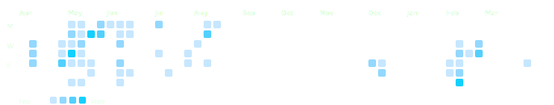

```aura width=800 height=990
<div style={{ display: 'flex', flexDirection: 'column', gap: 0, width: '100%', height: '100%', fontFamily: 'Inter, sans-serif', background: '#030305', borderRadius: 24, border: '1px solid rgba(255,255,255,0.08)', overflow: 'hidden', position: 'relative' }}>
  <style>
    {`
      @keyframes aurora-drift-1 {
        0%, 100% { transform: translate(0,0) scale(1); opacity: 0.38; }
        50% { transform: translate(70px, 35px) scale(1.06); opacity: 0.5; }
      }
      @keyframes aurora-drift-2 {
        0%, 100% { transform: translate(0,0) scale(1); opacity: 0.28; }
        50% { transform: translate(-55px, -28px) scale(1.07); opacity: 0.42; }
      }
    `}
  </style>

  {/* Aurora — only 2 blobs, very slow 32s/28s cycles */}
  <svg width="800" height="990" style={{ position: 'absolute', top: 0, left: 0, zIndex: 0 }} aria-hidden="true">
    <defs>
      <radialGradient id="a1" cx="50%" cy="50%" r="50%">
        <stop offset="0%" stopColor="rgba(0,130,255,0.28)" />
        <stop offset="100%" stopColor="rgba(0,130,255,0)" />
      </radialGradient>
      <radialGradient id="a2" cx="50%" cy="50%" r="50%">
        <stop offset="0%" stopColor="rgba(90,30,210,0.22)" />
        <stop offset="100%" stopColor="rgba(90,30,210,0)" />
      </radialGradient>
    </defs>
    <ellipse cx="620" cy="220" rx="300" ry="200" fill="url(#a1)" style={{ animation: 'aurora-drift-1 32s ease-in-out infinite' }} />
    <ellipse cx="180" cy="720" rx="270" ry="180" fill="url(#a2)" style={{ animation: 'aurora-drift-2 28s ease-in-out infinite' }} />
  </svg>

  {/* HERO */}
  <div style={{ display: 'flex', flexDirection: 'column', alignItems: 'center', justifyContent: 'center', width: '100%', height: 250, padding: 30, position: 'relative', zIndex: 10, borderBottom: '1px solid rgba(255,255,255,0.06)' }}>
    <div style={{ display: 'flex', flexDirection: 'column', alignItems: 'center', gap: 4 }}>
      <span style={{ fontSize: 58, fontWeight: 900, background: 'linear-gradient(135deg, #ffffff 0%, #b0d4ff 30%, #7ee7ff 55%, #60aaff 80%, #ffffff 100%)', backgroundClip: 'text', WebkitBackgroundClip: 'text', color: 'transparent', letterSpacing: 8 }}>PRABHAT</span>
      <span style={{ fontSize: 14, color: 'rgba(160,180,220,0.7)', fontWeight: 400, letterSpacing: 4, textTransform: 'uppercase', marginTop: 2 }}>B.Tech CSE · Cambridge Institute of Technology</span>
      <span style={{ fontSize: 13, color: 'rgba(230,240,255,0.5)', fontWeight: 300, letterSpacing: 1.5, marginTop: 8 }}>C# developer · .NET Core · AI/ML</span>
    </div>
    <div style={{ display: 'flex', gap: 8, marginTop: 22 }}>
      {['C# / C++', 'ASP.NET Core', 'Machine Learning', 'x86 ASM'].map((skill, i) => (
        <span key={i} style={{ padding: '6px 16px', background: 'rgba(255,255,255,0.04)', color: '#7ee7ff', borderRadius: 14, fontSize: 12, fontWeight: 600, border: '1px solid rgba(255,255,255,0.1)', letterSpacing: 1 }}>{skill}</span>
      ))}
    </div>
  </div>

  {/* LANGUAGES */}
  <div style={{ display: 'flex', flexDirection: 'column', width: '100%', padding: '18px 26px 16px', position: 'relative', zIndex: 10, borderBottom: '1px solid rgba(255,255,255,0.06)' }}>
    <span style={{ fontSize: 10, color: 'rgba(120,180,255,0.7)', textTransform: 'uppercase', letterSpacing: 3, marginBottom: 14, fontWeight: 800 }}>Most Used Languages</span>
    <div style={{ display: 'flex', width: '100%', height: 7, borderRadius: 4, overflow: 'hidden', marginBottom: 18, background: 'rgba(255,255,255,0.04)' }}>
      {(() => {
        const fb = [{name:'C#',percentage:38,color:'#00d4ff'},{name:'C++',percentage:28,color:'#f34b7d'},{name:'Python',percentage:12,color:'#3572A5'},{name:'C',percentage:8,color:'#777777'},{name:'x86 ASM',percentage:6,color:'#9a7c4a'},{name:'JS',percentage:4,color:'#f1e05a'},{name:'Other',percentage:4,color:'#563d7c'}];
        const langs = (github?.languages?.[0]?.name === 'TypeScript') ? fb : (github?.languages ?? fb);
        return langs.map((l, i) => <div key={i} style={{ width: `${l.percentage}%`, height: '100%', background: l.color }} />);
      })()}
    </div>
    <div style={{ display: 'flex', flexWrap: 'wrap', gap: '8px 24px' }}>
      {(() => {
        const fb = [{name:'C#',percentage:38,color:'#00d4ff'},{name:'C++',percentage:28,color:'#f34b7d'},{name:'Python',percentage:12,color:'#3572A5'},{name:'C',percentage:8,color:'#777777'},{name:'x86 ASM',percentage:6,color:'#9a7c4a'},{name:'JS',percentage:4,color:'#f1e05a'}];
        const langs = (github?.languages?.[0]?.name === 'TypeScript') ? fb : (github?.languages ?? fb);
        return langs.slice(0,6).map((l, i) => (
          <div key={i} style={{ display: 'flex', alignItems: 'center', gap: 6 }}>
            <div style={{ width: 8, height: 8, borderRadius: 4, background: l.color }}></div>
            <span style={{ fontSize: 12, color: 'rgba(230,240,255,0.8)', fontWeight: 600 }}>{l.name}</span>
            <span style={{ fontSize: 11, color: 'rgba(230,240,255,0.35)' }}>{l.percentage}%</span>
          </div>
        ));
      })()}
    </div>
  </div>

  {/* TECH STACK */}
  <div style={{ display: 'flex', gap: 10, padding: '12px 22px', width: '100%', alignItems: 'center', justifyContent: 'center', position: 'relative', zIndex: 10, borderBottom: '1px solid rgba(255,255,255,0.06)' }}>
    {['C#', 'C++', 'x86 ASM', 'Python', 'JavaScript', 'ASP.NET', 'PostgreSQL', 'React.js'].map((t, i) => (
      <span key={i} style={{ padding: '4px 14px', background: 'rgba(0,0,0,0.15)', color: '#7eb8ff', borderRadius: 16, fontSize: 12, fontWeight: 700, border: '1px solid rgba(255,255,255,0.08)' }}>{t}</span>
    ))}
  </div>

  {/* STATS */}
  <div style={{ display: 'flex', width: '100%', height: 100, alignItems: 'center', justifyContent: 'center', position: 'relative', zIndex: 10, borderBottom: '1px solid rgba(255,255,255,0.06)' }}>
    <div style={{ display: 'flex', alignItems: 'center', width: '100%', justifyContent: 'space-around', padding: '0 20px' }}>
      {[{v: github?.stats?.totalStars, l: 'Stars', c: '#fde047'}, {v: github?.stats?.totalForks, l: 'Forks', c: '#ff7eb9'}, {v: github?.stats?.totalRepos, l: 'Repos', c: '#7ee7ff'}, {v: github?.stats?.totalCommits, l: 'Commits', c: '#a855f7'}].map((s, i) => (
        <div key={i} style={{ display: 'flex', flexDirection: 'column', alignItems: 'center', gap: 3 }}>
          <span style={{ fontSize: 34, fontWeight: 900, color: '#ffffff', lineHeight: 1 }}>{s.v ?? 0}</span>
          <span style={{ fontSize: 10, color: s.c, textTransform: 'uppercase', letterSpacing: 4, fontWeight: 800, opacity: 0.8 }}>{s.l}</span>
        </div>
      ))}
    </div>
  </div>

  {/* CONTRIBUTION CALENDAR — pre-rendered SVG from GitHub API (zero render cost) */}
  <div style={{ display: 'flex', flexDirection: 'column', width: '100%', padding: '14px 22px 10px', position: 'relative', zIndex: 10, borderBottom: '1px solid rgba(255,255,255,0.06)' }}>
    <div style={{ display: 'flex', alignItems: 'center', gap: 10, marginBottom: 8 }}>
      <span style={{ fontSize: 10, color: 'rgba(255,255,255,0.5)', textTransform: 'uppercase', letterSpacing: 3, fontWeight: 800 }}>Contribution Activity</span>
      <div style={{ flex: 1, height: 1, background: 'linear-gradient(90deg, rgba(255,255,255,0.1), transparent)' }}></div>
    </div>
    
  </div>

  {/* PROJECTS */}
  <div style={{ display: 'flex', width: '100%', position: 'relative', zIndex: 10, borderBottom: '1px solid rgba(255,255,255,0.06)' }}>
    {[{t:'KinetX',d:'Custom physics engine with Verlet integration and high-performance collision pipeline.',tags:['C#','WPF']},{t:'ColdFish',d:'Chess engine with SDL2 GUI, Minimax/Alpha-Beta reaching 1500 ELO.',tags:['C++','SDL2']},{t:'MetalNet',d:'High-performance CNN from scratch in C++ with custom tensor system and modular architecture.',tags:['C++','Ninja']}].map((p, i) => (
      <div key={i} style={{ display: 'flex', flexDirection: 'column', flex: 1, padding: 20, background: i === 1 ? 'rgba(255,255,255,0.02)' : 'transparent', borderRight: i < 2 ? '1px solid rgba(255,255,255,0.06)' : 'none' }}>
        <span style={{ fontSize: 15, fontWeight: 800, color: '#ffffff', marginBottom: 4 }}>{p.t}</span>
        <span style={{ fontSize: 11, color: 'rgba(230,240,255,0.5)', lineHeight: 1.4, marginBottom: 12 }}>{p.d}</span>
        <div style={{ display: 'flex', gap: 5, marginTop: 'auto' }}>
          {p.tags.map((tag, j) => (
            <span key={j} style={{ padding: '2px 10px', background: 'rgba(255,255,255,0.05)', color: '#7ee7ff', borderRadius: 8, fontSize: 10, fontWeight: 600, border: '1px solid rgba(255,255,255,0.08)' }}>{tag}</span>
          ))}
        </div>
      </div>
    ))}
  </div>

  {/* STREAK */}
  <div style={{ display: 'flex', width: '100%', height: 155, alignItems: 'center', justifyContent: 'center', position: 'relative', zIndex: 10 }}>
    
  </div>
</div>
```

<div align="center">


</div>
